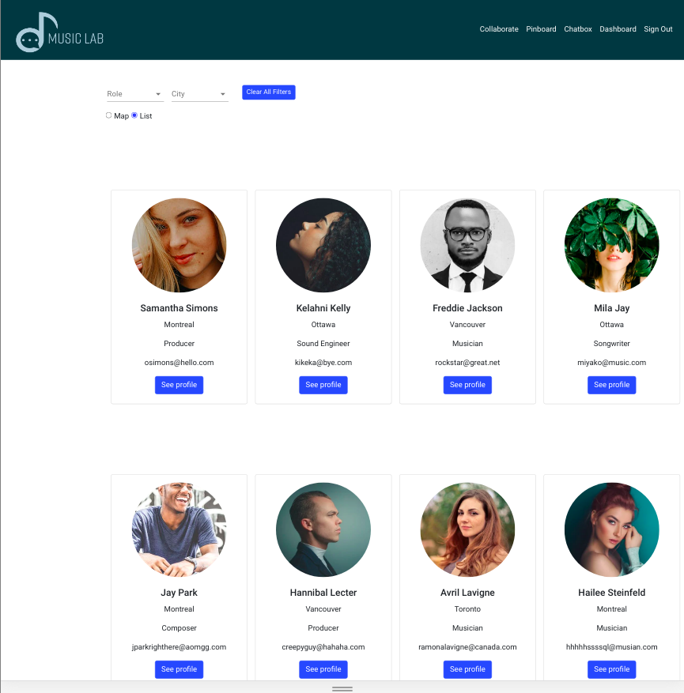
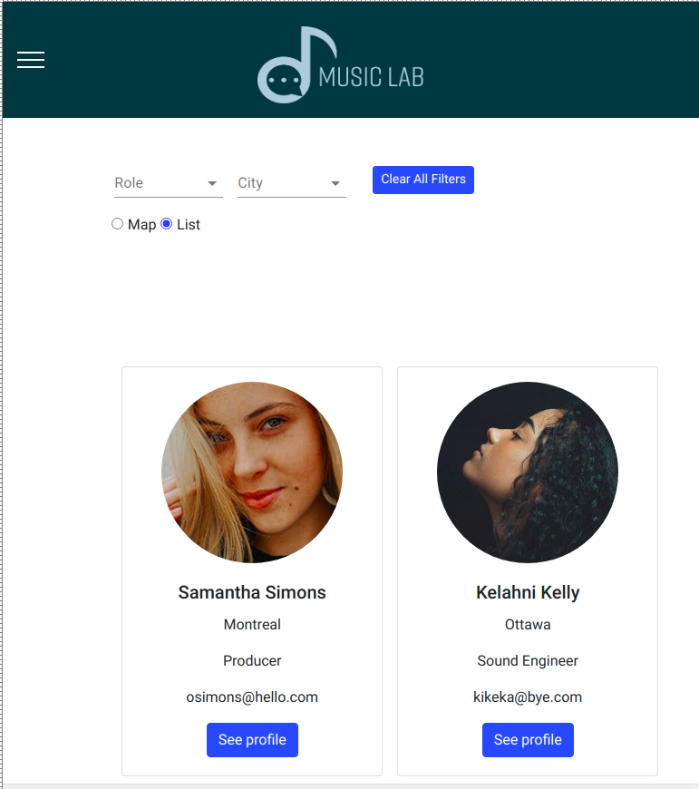
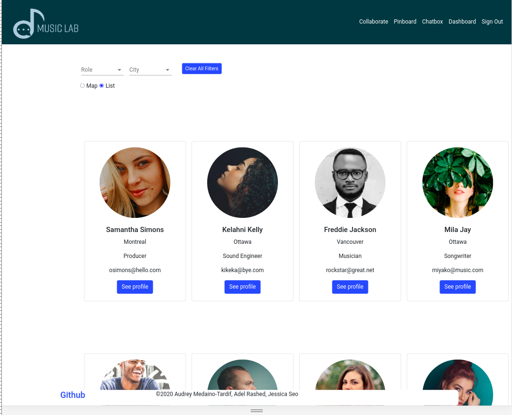
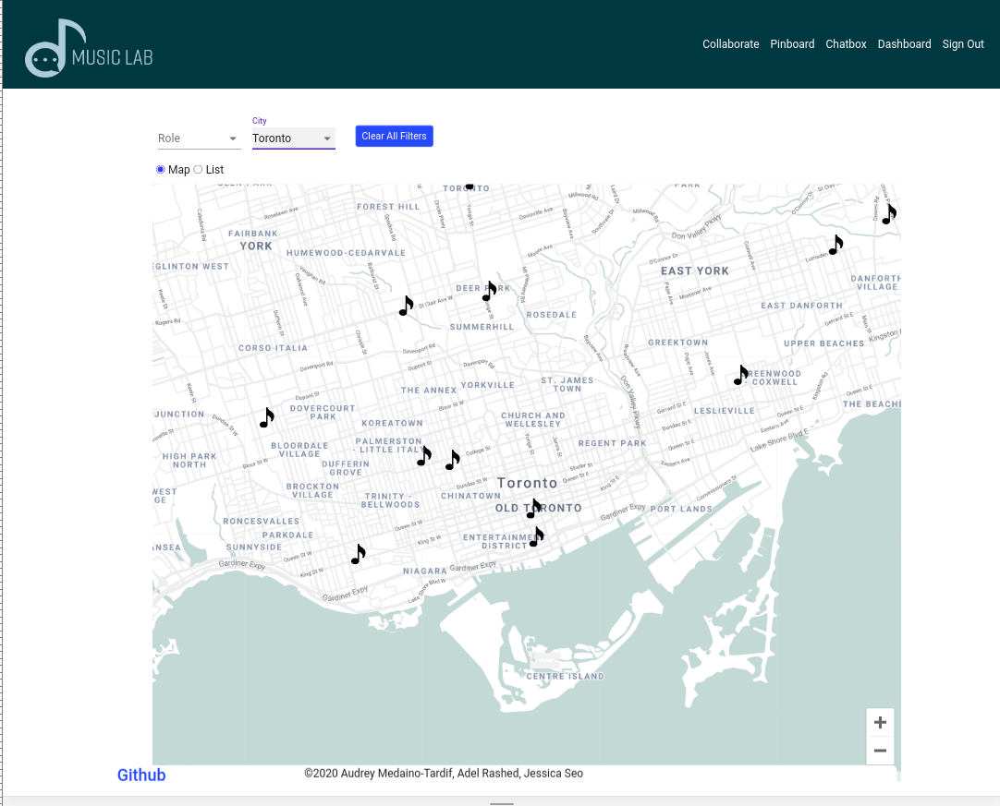
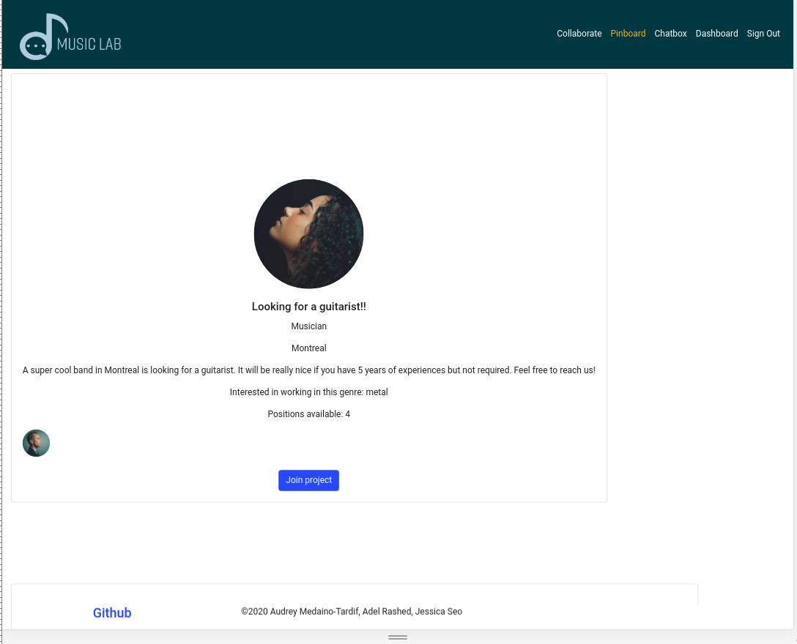
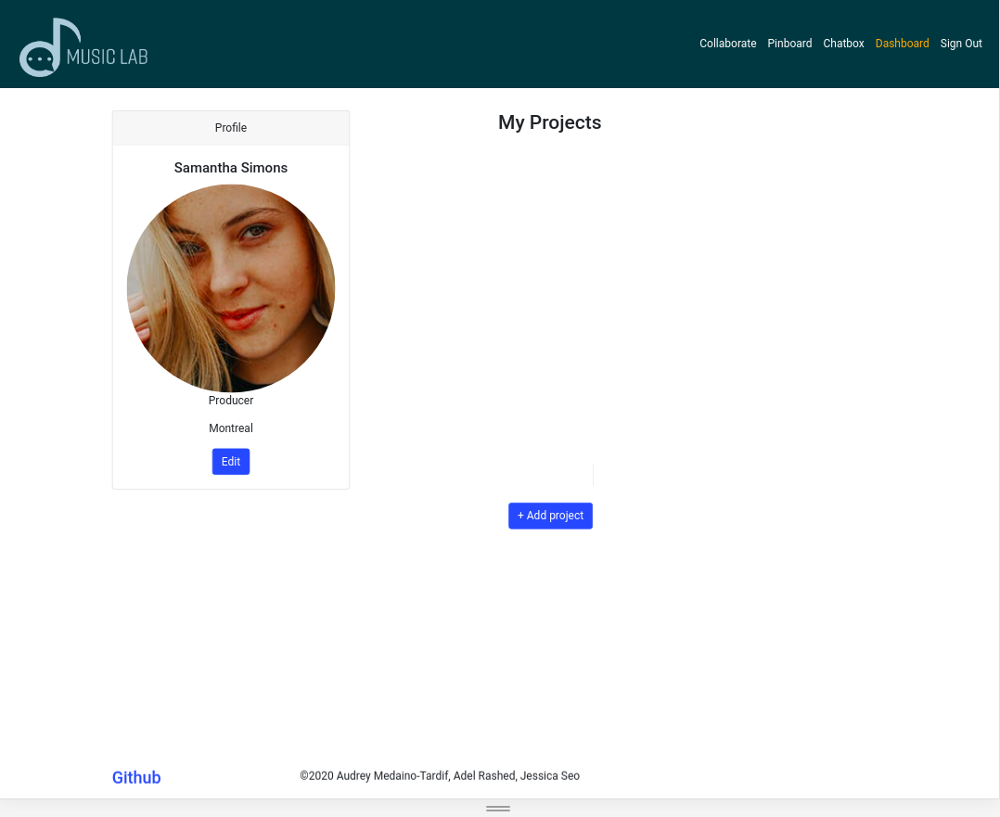

# Music Lab
## Project Description
This is an app created by artists for artists. Artists know that one of the hardest things to find is a good match for collaboration. Pinboards and newspaper ads used to be one method to seek and find a missing link to your band or a missing link to your work. Our project seeks to cater to a starting artists need to find contacts in the industry and find collaboration in an environment that is as safe and community specific as possible. 

## Product
### Responsive Design
* Laptop View

* Tablet View

* Mobile View

### Features

#### Collaborate
The collaborate feature allows users to search for other users. Users can search in list view or map view. Users can also filter results by city and role.

* List View

* Map View

#### Pinboard
The pinboard features allow users to post and view ads for projects.

#### Dashboard
The dashboard is the user profile page. A user is able to edit their information and add their projects.

## Contributors
* Adel Rashed ([Github: AdelRashed97](https://github.com/AdelRashed97))

* Jessica Seo ([Github: jessicaseo83](https://github.com/jessicaseo83))

* Audrey Medaino-Tardif ([Github: odgerey](https://github.com/odgerey))

## Tech Stack
### Front-End
* React
* Bootstrap
* Material UI

### Back-End
* Node Js
* Express
* Postgresql
* Socket.io